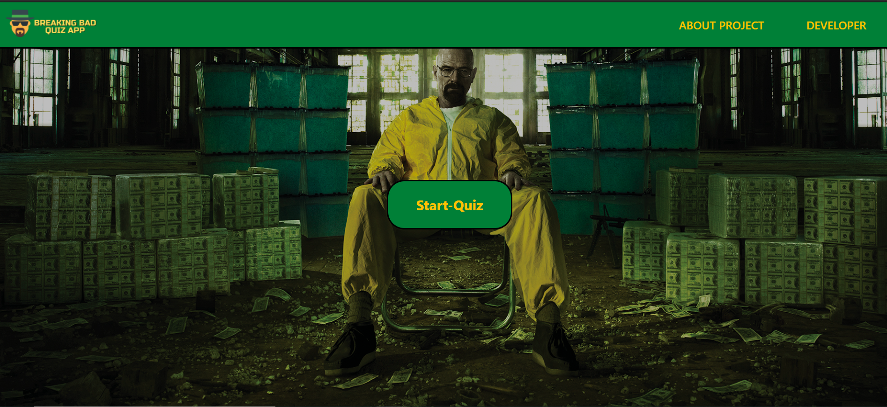

# Breaking Bad Quiz App

Breaking Bad Quiz App is a web-application 
designed for testing the true fans of the show
by playing a fun quiz 😉. The quiz has been
built using an API that fetches all kinds 
of information regarding the show.

**Live Preview** : [The Breaking Bad Quiz App](https://aniketpathak028.github.io/Breaking-Bad-Quiz-App/)



## Demo


## API Reference
I have used The Breaking Bad API for this
project, you can head on their site and
read the API docs to get a better idea.


#### Fetching quotes

```http
  GET /api/quote/random
```

#### Fetching a random character

```http
  GET /api/character/random
```

#### Fetching a character by id

```http
  GET /api/characters/4
```

| Parameter | Type     | Description                       |
| :-------- | :------- | :-------------------------------- |
| `id`      | `number` | **Required**. Id of item to fetch |

## FAQ

#### Q1. How does is work?

Ans: So, every person has to answer 10 Questions, each with 
4 options and based on his/her score he/she will be judged
whether or not he/she is a true fan. 

#### Q2. I got same options in some questions?

Ans: Yeah, that can happen, as the options are generated randomly
hence, I cannot guarantee that all options will be different,
however, I am working to resolve this bug.

#### Q3. What API does this project use?

Ans: This project uses the Breaking Bad API, linked below: 

[The Breaking Bad API](https://breakingbadapi.com/)

  
## 🚀 About Me
I'm a Web Developer, currently learning the
MERN stack. I believe in learning, by doing, 
hence, I keep building fun projects as 
such to apply my knowledge and skills 🙂

  
## Feedback

If you have any feedback, please reach out to me at aniketpathak028@gmail.com

  
## Contributing

Contributions are always welcome!


  
## Author

- [Aniket Pathak](https://www.github.com/aniketpathak028)

  
